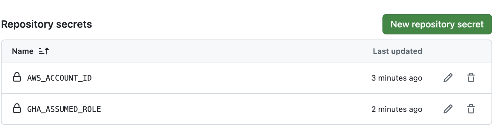

#

# Instructions to create a Docker image can be found here https://docs.aws.amazon.com/lambda/latest/dg/images-create.html


# Build image

Build image with the command

```shell
docker build -t aws-lambda-test --platform linux/amd64 . &> logs/build-$(date +%s).log
```

Then run it with 
```shell
docker run --platform linux/amd64 -p 9000:8080 aws-lambda-test:latest
```

This will start an attached process in a terminal session. In a separate session, execute a command
```shell
curl "http://localhost:9000/2015-03-31/functions/function/invocations" -d '{}'
```
If everything works, then you will see log messages in a main session.
More information can be found [here](https://docs.aws.amazon.com/lambda/latest/dg/python-image.html#python-image-instructions).


# Push image to ECR

For automatic deployment, we are going to create a GitHubActions script that will build a docker 
image and push it to ECR. For GHA to work properly, you need to create AssumedRole that will
be used for interaction between GitHub and AWS. Then, you need to add the following variables
as secrets to the repo:


# Create IAM role and lambda function

# Update function on every push to main

As per [documentation](https://docs.aws.amazon.com/cli/latest/reference/lambda/update-function-code.html):
```text
For a function defined as a container image, Lambda resolves the image tag to an image digest. 
In Amazon ECR, if you update the image tag to a new image, Lambda does not automatically update 
the function.
```

This means that if we simply push image to ECR with tag _latest_, the function will not catch 
those changes and continue to use the old code.
